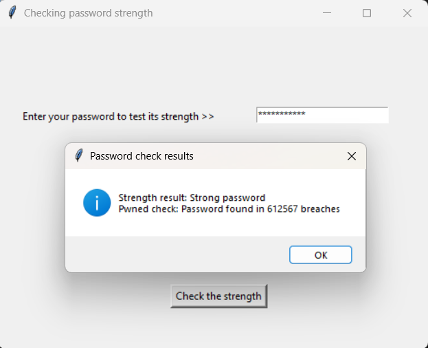

# Password Strength Checker

Simple Python Tkinter app that analyses the strength of a password using regular expressions, and checks if the password has been exposed in data breaches using the HaveIBeenPwned API (https://haveibeenpwned.com/API/v3). 
The password is kept secure throughout using hashing and k-anonymisation. 

## Screenshot
