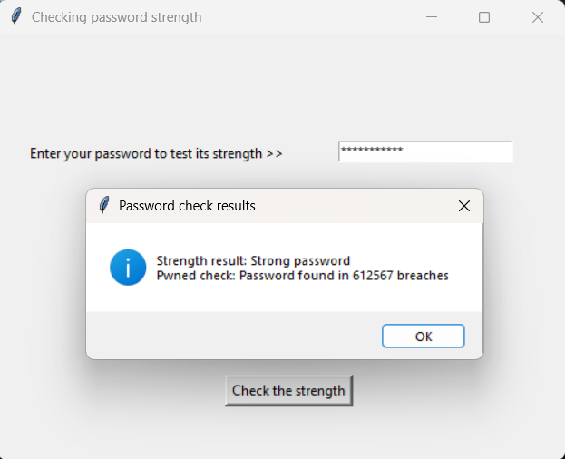

# Password Strength Checker

Lightweight Python and Tkinter app that analyses the strength of a password locally using regular expressions, and checks if the password has been exposed in data breaches using the HaveIBeenPwned API (https://haveibeenpwned.com/API/v3). 

Stength scoring is based on upper/lower case letters, digits, symbols and length. 

One of the challenges I faced included preserving privacy, so as a result I had to research how to avoid data leakage. The answer I came up with included the password being kept secure through first hashing it, then using k-anonymisation by sending only the first 5 characters of the hash to the API. This returns a list of possible matches to check against, but ensures the password and even full hash never leave the device - ensuring privacy. 

To run, clone the repo and install the dependency requests.

## Screenshot - using 'Password123' as the password

