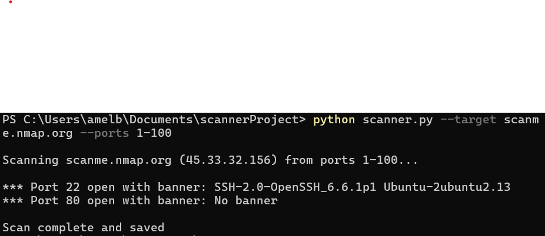

# Multi-threaded Port Scanner

Built using Python, this multi-threaded port scanner resolves a target hostname into an IP address and spins up a thread per port in the prescribed range.
Each thread attempts to make a TCP connection, and marks the port as open or closed before attempting to grab a banner if open. The results are then collected and written into a CSV file. 

## Features:
Works with both IPv4 and IPv6 addresses

Custom target and port range

Can grab banners for additional information

Results are saved to a csv file

Multi-threading improves speed

Uses Python libraries socket, threading, csv, argparse

Requires Python 3.7+

## Challenges 
Handling the difference betweem IPv4 and IPv6 connections
Managing the multi-threading, ensuring the threads didn't timeout too quickly

## Screenshot of console results

